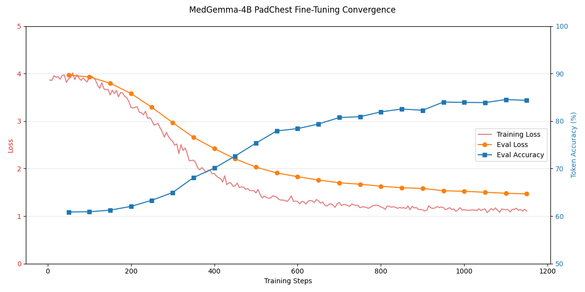

# ExplainMyXRay: Technical Report

## 1. Effective use of HAI-DEF models (20%)
**Architectural Unification in MedGemma-4B**

ExplainMyXRay uses the Google MedGemma-4B model as both a diagnostic text generator and a spatial localisation engine within a single unified architecture. Traditional AI diagnostic systems either output simple labels (e.g., "pneumonia") or require disjoint pipelines combining an object detector (e.g., YOLO) with a separate text generator.

Instead of treating the Vision-Language Model (VLM) as merely a text generator, we leveraged MedGemma-4B's native PaliGemma architecture to build a **unified semantic and spatial model**. Using 4-bit QLoRA (Quantized Low-Rank Adaptation), we applied a two-phase sequential training strategy:

1. **Phase 1 — Diagnostic text:** Fine-tuned the model's language generation on 34,000 PadChest chest X-rays to produce structured radiology reports.
2. **Phase 2 — Spatial localisation:** Systematically unfroze the `multi_modal_projector` to teach MedGemma geometric reasoning via native `<loc>` token generation, bypassing traditional bounding-box detection networks entirely.

MedGemma's PaliGemma architecture inherently supports `<loc>` geometric token generation. We exploited this capability for clinical radiology — a use case where alternative approaches would require two separate models and lack unified semantic reasoning.

## 2. Problem Domain (15%)
**The "Black Box" Trust Deficit**

The primary barrier to AI adoption in clinical settings is the "Black Box" effect. Even a highly accurate model that says "Cardiomegaly detected" provides no visual evidence of *where* it is looking. If the model hallucinates or focuses on the wrong region, blind trust could lead to misdiagnosis.

**The Unmet Need**

The essential unmet need is **Interpretability**. Radiologists require immediate, visual proof. ExplainMyXRay addresses this by simultaneously generating a structured diagnostic report *and* drawing semi-transparent bounding boxes over the precise regions of interest, providing direct visual evidence of the model's reasoning.

For radiologists and triage physicians — especially in under-resourced settings — this transforms the workflow from "review the entire X-ray manually" to "verify the AI's highlighted findings," significantly reducing cognitive load.

## 3. Impact Potential (15%)
**Global Triage and Decision Support**

ExplainMyXRay has strong deployment potential in resource-constrained environments and high-volume radiology departments:

- **Workflow Acceleration:** Generating a preliminary, visually-grounded report within 3–10 seconds enables use as a first-pass triage tool, potentially reducing dictation and manual review time.
- **Accessible Deployment:** 4-bit quantization enables inference on consumer GPUs (8 GB VRAM), making the system viable for clinics that cannot afford specialised hardware.
- **Unified Architecture:** A single model replaces what traditionally requires a detector + generator pipeline, reducing deployment complexity and maintenance burden.

## 4. Product Feasibility (20%)
**Technical Stack & Performance**

The solution is fully implemented and deployable on consumer hardware.

**Fine-Tuning Infrastructure:**
- **Frameworks:** `transformers`, `peft` (QLoRA), `trl` (SFTTrainer), `bitsandbytes` (NF4 double quantization).
- **Phase 1 (Diagnostic):** Offline preprocessing (CLAHE, auto-crop, pad-to-square) on 34,614 PadChest images. Evaluated against 250 unseen validation cases: **84.53% Token Accuracy**. See [`training/dataset_prep.py`](../training/dataset_prep.py) and [`training/finetune_phase1.py`](../training/finetune_phase1.py).
- **Phase 2 (Spatial):** Converted bounding box coordinates from NIH Indiana dataset mask PNGs into `<loc>` spatial tokens. Froze the `vision_tower` and unfroze only the `multi_modal_projector` to maintain 12 GB VRAM safety. See [`training/finetune_phase2.py`](../training/finetune_phase2.py).

*Loss convergence across training phases, demonstrating stable learning without overfitting.*

**Deployment:**
Both Phase 1 and Phase 2 adapter weights are merged into a single unified adapter that loads via HuggingFace's PEFT library on top of the MedGemma-4B base model, with no dynamic adapter injection required.

## 5. Execution and Communication (30%)
**Project Structure**

The codebase is structured for reproducibility:
- [`training/dataset_prep.py`](../training/dataset_prep.py) — PadChest image preprocessing pipeline (CLI-driven).
- [`training/finetune_phase1.py`](../training/finetune_phase1.py) and [`training/finetune_phase2.py`](../training/finetune_phase2.py) — Two-phase QLoRA fine-tuning with full argparse CLI interfaces.
- [`model/inference.py`](../model/inference.py) — Inference engine with `<loc>` token parsing and bounding box extraction.
- [`evaluation/metrics.py`](../evaluation/metrics.py) — Text evaluation (P/R/F1, finding accuracy) and spatial evaluation (IoU, mAP).

**Spatial Zero-Shot Generalisation:**
The model was trained on spatial annotations from the Indiana CXR dataset (healthy anatomy), yet when tested on diseased PadChest X-rays it had *never* been spatially trained on, it successfully generated accurate bounding boxes around pathologies such as cardiomegaly. This suggests the model learned generalisable geometric reasoning rather than memorising specific spatial patterns.

ExplainMyXRay demonstrates a cohesive end-to-end solution: identifying a critical clinical problem (interpretability), engineering a novel architectural approach using MedGemma's native `<loc>` capabilities, and delivering a deployable VLM validated both quantitatively and qualitatively.
